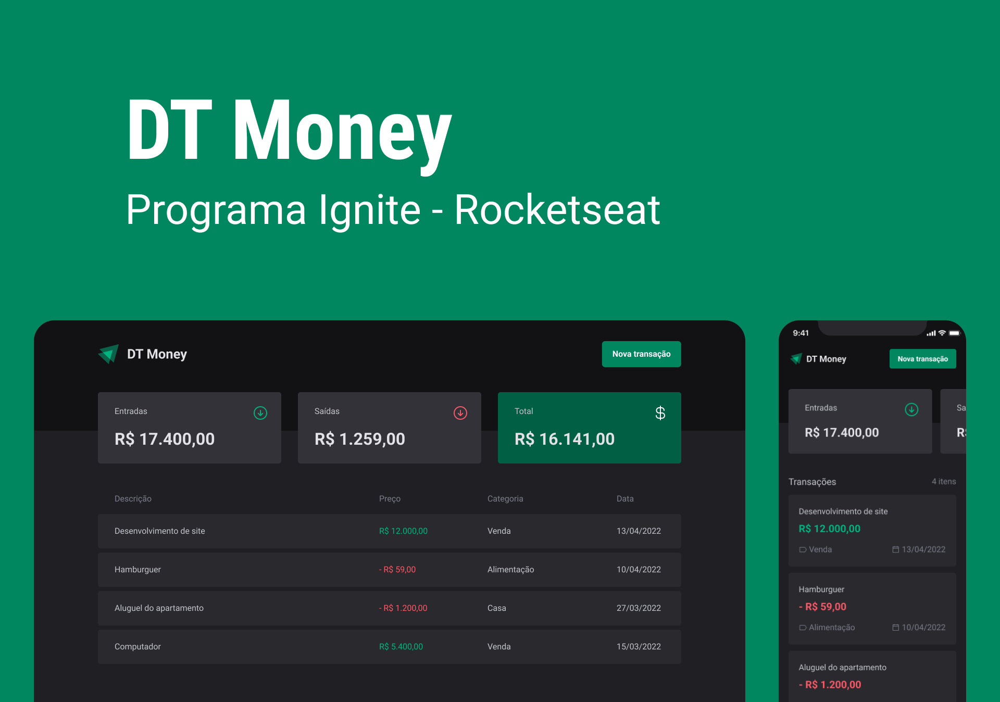

<p align="center">
  
</p>

## **💻** Projeto

Para conclusão de módulo, a fim consolidar ainda mais meus conhecimentos sendo alinhado com as novas e melhores práticas e tecnologias disponíveis no mundo da tecnologia, realizei durante o programa de aceleração “Ignite - ReactJS”, promovido pela Rocketseat, uma aplicação Frontend chamado DT Money, onde podemos treinar minhas habilidades com ReactJS, utilizando Hooks, componentes, propriedades, Imutabilidades, etc. Além disso, para estilizando foi utilizado Styled Component, lib CSS-in-JS.

<p align="center">
  
</p>

## Tecnologias utilizadas

- [Vite](https://vitejs.dev/)
- [Typescript](https://www.typescriptlang.org/)
- [ReactJS](https://pt-br.reactjs.org/)
- [Styled Component](https://styled-components.com/)
- [Phosphor icons](https://phosphoricons.com/)
- [useContext Selector](https://github.com/dai-shi/use-context-selector)
- [React Hook form](https://react-hook-form.com/)
- [Zod](https://github.com/colinhacks/zod)
- [Radix-UI](https://www.radix-ui.com/)
- [Axios](https://axios-http.com/ptbr/docs/intro)
- [ESLint](https://eslint.org/)
- [json-server](https://www.npmjs.com/package/json-server)

## **🚀** Como Executar

Antes de baixar o projeto você vai precisar ter instalado na sua máquina as seguintes ferramentas:

- [Git](https://git-scm.com/)
- [NodeJS](https://nodejs.org/en/)
- [NPM](https://www.npmjs.com/)

```bash
## Clone o projeto em sua máquina
git clone https://github.com/srsouzaj/dt-money.git

# Acessar o projeto no terminal
$ cd dt-money

# Instalar as dependências
$ npm install

# Executar o servidor em modo de desenvolvimento
$ npm run dev
```

## 📝 License

Esse projeto está sob a licença MIT. Veja o arquivo [LICENSE](https://github.com/srsouzaj/igniteFeed/blob/master/LICENSE.MD) para mais detalhes.

---
Feito por Jorge de Souza
